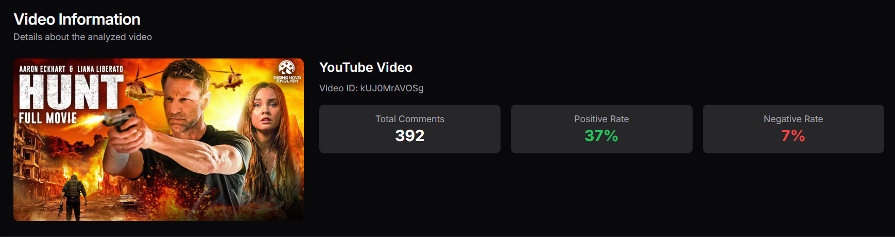
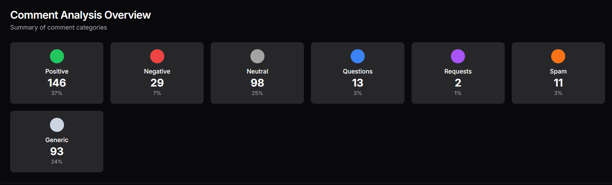
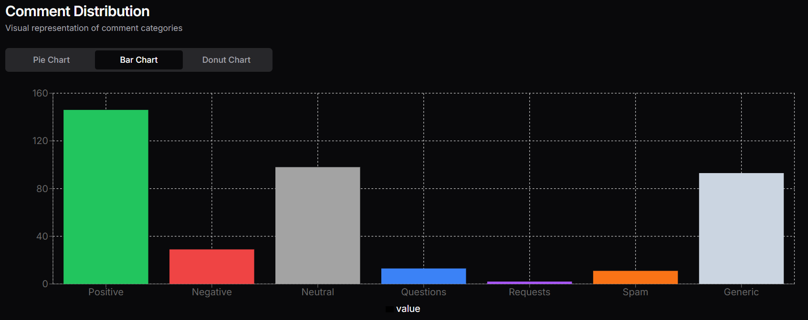
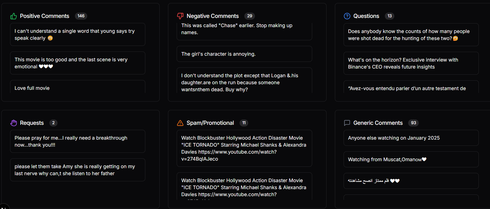
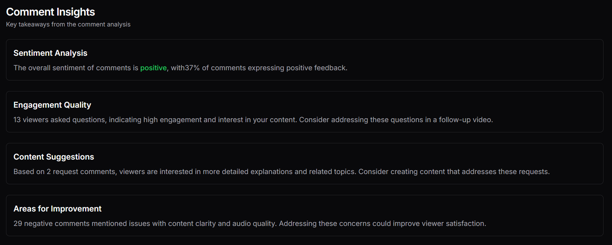

# 📊 YouTube Comment Analyzer

A full-stack web application that analyzes YouTube video comments and classifies them into categories such as Positive, Negative, Question-Based, Request, Engagement/Generic, and Promotional/Spam. Designed for social impact, this tool helps content creators and researchers gain insights into audience sentiment and behavior.

## 🚀 Live Demo

[👉 Deployed link will be added in future](https://your-deployed-link.com)

## 🖼️ Screenshots







## 🧠 Features

- 🔍 Paste a YouTube video URL and fetch all comments via the backend.
- 🤖 Categorize comments using a trained ML/NLP model into 6 distinct types:
  - Positive
  - Negative
  - Question-Based
  - Request
  - Engagement/Generic
  - Promotional/Spam
- 📊 Interactive graph visualizations (Bar, Pie, etc.) to view category distribution.
- 🔄 Switch between visual formats seamlessly.
- 🔐 Authentication using Clerk (email/password, social logins).
- 💬 Smooth UI with scrollable chat-like comment displays and typing animation.
- ⚡ Built with performance, accessibility, and responsiveness in mind.

---

## 🛠️ Tech Stack

**Frontend**
- Next.js 14 (App Router)
- TypeScript
- Tailwind CSS
- ShadCN UI + Aceternity UI
- Framer Motion

**Backend**
- ML/NLP Model for comment classification
- REST APIs to fetch and categorize data

**Other Tools**
- Clerk for Authentication
- Chart.js or Recharts for graphs
- Fetch Method for API calls

---

## 🧑‍💻 Getting Started

### 1. Clone the Repository

```bash
git clone https://github.com/CodewithMK180105/Youtube_Comment_Analyser.git
cd Youtube_Comment_Analyser